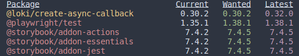

# Code Quality

## Checklist

- **Linting**:
  - [ ] Utilize ESLint with the Airbnb JS Style Guide for JavaScript linting.
  - [ ] Implement Stylelint with stylelint-order plugin for CSS/SCSS linting.
  - [ ] Apply HTMLHint for HTML linting.
  - [ ] Automate code linting with pre-commit hooks using Husky.
  - [ ] Consider integrating formatters like Prettier for code formatting alongside linting.

- **Testing** (if applicable for your project):
  - [ ] Utilize a test runner like Jest, native Node test runner, or Vitest for testing.
  - [ ] Employ Testing Library for efficient front-end app testing.
  - [ ] Consider end-to-end testing with tools like Puppeteer or Playwright for critical application flows.
  - [ ] Optionally, incorporate visual testing with tools like Storybook and Loki for front-end apps.
  - [ ] Avoid tests interacting with real-world elements; use mocking and stubbing tools like Nock or Mock Service Worker.

- **Naming**:
  - [ ] Use camel case for variables and function names.
  - [ ] Avoid Hungarian notation; use descriptive names instead.
  - [ ] Avoid one-letter variable names except for loop counters or indexes.
  - [ ] Use semantic and descriptive names that reflect the function's action.
  - [ ] Prefix predicate function names with "is" or "has" for clarity.
  - [ ] Name collections in plural form and quantities as noun + Count.

- **Dependencies Management**:
  - [ ] Regularly update packages to leverage the latest features and security patches.
  - [ ] Utilize semantic versioning (semver) for package updates in package.json.
  - [ ] Use caret symbol (^) to allow updates of patch and minor versions.
  - [ ] Check and update outdated packages regularly, at least monthly, and before release.

- **Interface Texts Storing**:
  - [ ] Organize interface texts using i18next for centralized storage and internationalization.
  - [ ] Store interface texts in a `locales` directory with modules for different languages.
  - [ ] Access interface texts using the useTranslation hook in components.
  - [ ] Consider this approach to prevent the use of magic strings and improve maintainability.

## Linting

Linter helps to write readable code and prevents some errors. Linting helps developers to work together. 

One of the most popular linters in JS world is [ESLint](https://eslint.org/). You can use different coding standards with linter. One of the most popular is [Airbnb JS Style Guide](https://github.com/airbnb/javascript). You can extend chosen styleguide according to your/your team mates preferencies with additional rules and plugins. For example, [eslint-plugin-functional](https://www.npmjs.com/package/eslint-plugin-functional) helps to write declarative code. 

You can use [Stylelint](https://stylelint.io/) to lint CSS/SCSS code. Your HTML can be linted with [HTMLHint](https://htmlhint.com/).

### Default recommended linters for new projects:

- ESLint with Airbnb JS Style Guide.
- Stylelint with [stylelint-order plugin](https://github.com/hudochenkov/stylelint-order).
- HTMLHint.

It’s highly recommended to automate code linting by running pre-commit hook with linter check. Pay attention to [Husky](https://typicode.github.io/husky/), this tool will help you to set-up and manage pre-commit hooks.

It is possible to use formatters like Prettier with linter, but it is not mandatory. Linter is preferable solution, because it is not only formats your code, but checks it semantic too.

## Testing

Tests check whether your app works correct. If you want to know why it is important to test code and get some information about testing on FE, please check these videos: [Testing. Part 1](https://youtu.be/Olvy8N-w0h0) and [Testing. Part 2](https://youtu.be/jbLL6SdcjR0).

To start testing, you need to use a test runner, e.g. [Jest](https://jestjs.io/), [native Node test runner](https://nodejs.org/api/test.html), [Vitest](https://vitest.dev/) etc.

[Testing Library](https://testing-library.com/) helps to test FE apps with optimal time costs/effectiveness ratio. This tool is [standard de-facto for React components testing](https://kentcdodds.com/blog/introducing-the-react-testing-library).

Critical parts of your application, e.g. payment flow, log-in, checkout flow etc, can be tested with end-to-end (e2e) testing instruments. These are Puppeteer, Playwright etc. E2e tests are most expensive, so use this instrument wisely.

In some scenarios you can use visual testing of FE apps. For example, it is possible to do [with Storybook and Loki](https://storybook.js.org/addons/loki).

In general, tests should not interact with real world, e.g. file system, API, DB etc. For mocking and stubbing you can use [Nock](https://github.com/nock/nock), [Mock Service Worker](https://mswjs.io/) and other tools.

You can track code coverage with instruments like [CodeCov](https://about.codecov.io/) or [Code Climate](https://docs.codeclimate.com/docs/configuring-test-coverage).

It is good to test your project code by default without discussing it with client, because non-tech people usually don’t understand what is tests and why do we need to write tests. Scope of testing, instruments, desired level of code coverage should be defined individually for every project.

## Naming

Naming is very important aspect of code quality, because clear, semantic, conventional naming helps other developers (and you from the nearest future) to understand code.

Your can find very interesting and useful recommendations about naming in Chapter 11 of Code Complete by Steve McConnell ([this book is present in our digital library](https://file.notion.so/f/s/01632cdd-9363-4689-b124-628131f9730d/%D0%A1%D0%BE%D0%B2%D0%B5%D1%80%D1%88%D0%B5%D0%BD%D0%BD%D1%8B%D0%B9_%D0%BA%D0%BE%D0%B4_(_PDFDrive_).pdf?id=49c13745-81c9-4828-826b-b590fba7c923&table=block&spaceId=ad363e30-3814-4fc5-a250-015644c0389f&expirationTimestamp=1696435200000&signature=KXyWCVk5xlCjggFqKQTGFOCuDVp1dkAxbn0J2c8fSr8&downloadName=%D0%A1.+%D0%9C%D0%B0%D0%BA%D0%BA%D0%BE%D0%BD%D0%BD%D0%B5%D0%BB%D0%BB+-+%D0%A1%D0%BE%D0%B2%D0%B5%D1%80%D1%88%D0%B5%D0%BD%D0%BD%D1%8B%D0%B9+%D0%BA%D0%BE%D0%B4.pdf), see page 273 in pdf-version).

Some examples and recommendations:

- Use camel case, e.g. `userBooks`, `firstClassCitizen` etc.
- In general try to avoid [Hungarian notation](https://en.wikipedia.org/wiki/Hungarian_notation), it is better to use `books`, not `~~booksArray~~`, `title`, not `~~titleString~~` etc.
- Avoid one-letter names. Names like `i` is appropriate only as counters or indexes in loops.
- Avoid generalized non-semantic names like `items.filter((item) => !!item)`; it is better to filter books, users, cars etc., not items: `books.filter((book) => ...)`.
- Name of function should reflect action, so function name should be verb or should contain verb: `resetForm()`, `getUsers()`, `fetchPosts()`, `calculateDiff()` etc.
- Predicate functions names should start with `is`: `isValid()`. In some cases you need predicate to check whether something present somewhere, e.g. whether user has discount: `hasDiscount()`. Another case of predicate naming: check whether something is allowed - `canFly(user)`.
- Use plural form on nouns to name collections: `users`, `userBooks` etc.
- Quantity can be named as noun + Count, e.g. `booksCount`. Don’t use here `countBooks`, this is good name for function: `countBooks()`.
- Boolean variable does not need to start with `is` like predicate functions: `const validEmail = isValidEmail(userEmail)`.

## Dependencies management

It is important to keep packages in your project updated. This strategy gives you important benefits:

- You can use latest features of libraries.
- You get protection from vulnerabilities.
- You prevent situation, when you are locked with outdated package and need major changes to update dependencies.

If you use npm or yarn as package managers, all your packages are following semantic versioning ([semver](https://semver.org/)) system. This means you can update patch and minor versions of packages without risk to break your app. 

You can use caret symbol (`^`) in your `package.json` to allow updates of patch and minor versions:

```json
"dependencies": {
  "react": "^18.2.0",
}
```

Major version updates can have breaking changes, so you need to check it and fix it if needed. 

To check outdated packages, you can use `npm outdated` command. In the output you will see current, wanted and latest versions of packages. 



It is recommended to check and updated outdated packages regularly, at least monthly. Besides that you need to check dependencies before release.

## Interface texts storing

We are building user interfaces, that are represented with different elements with texts. For example buttons, menu items etc. contain text. Often it looks this way in code:

```jsx
const Modal = () = {
  return (
    <div>
      <h3>Do you agree?</h3>
      <button>Yes</button>
      <button>No</button>
    </div>
  );
};
```

Here we store interface texts - modal title and buttons texts - in component code. That is not problem if you have small and simple components and your app is not big. But if you have big app with complex interface, storing texts in code becomes problematic. 

One of the way to organize interface texts is to use [i18next](https://www.i18next.com/). This is library for internationalization, but you can use it even if you don’t need internationalize your app now. 

With i18 you can store all interface texts in `locales` directory (usually `src/locales`). In this directory you can have modules like `en.js`, `ua.js`, `es.js` (for English, Ukrainian, Spanish texts etc.). 

Example of `en.js`: 

```jsx
export default {
  translation: {
    modal: {
     title: "Do you agree?",
     confirmButton: "Yes",
     rejectButton: "No"
    },
  },
};
```

You can access these texts with `useTranslation` hook in your component:

```jsx
import { useTranslation } from 'react-i18next';

const Modal = () = {
  const { t } = useTranslation();

  return (
    <div>
      <h3>{t('modal.title')}</h3>
      <button>{t('modal.confirmButton')}</button>
      <button>{t('modal.rejectButton')}</button>
    </div>
  );
};
```

Useful link: https://react.i18next.com/

This approach to organizing interface texts helps to prevent common anti-pattern: [magic strings](https://stoic.software/effective-suitescript/magic-strings-the-anti-pattern/).

## Summary:

### Linting:
- **Importance:** Linting ensures code readability and error prevention, facilitating collaboration among developers.
- **Popular Tools:** Utilize ESLint with the Airbnb JS Style Guide for JavaScript linting, Stylelint for CSS/SCSS linting, and HTMLHint for HTML linting.
- **Recommended Setup:** Automate code linting using pre-commit hooks with tools like Husky to ensure consistent adherence to coding standards.
- **Additional Consideration:** While formatters like Prettier can be used alongside linters, prioritizing linting is preferred as it not only formats code but also checks its semantics.

### Testing:
- **Significance:** Testing verifies code functionality and is crucial for ensuring app reliability.
- **Key Tools:** Employ Jest or other test runners for unit testing, Testing Library for efficient component testing, and end-to-end testing tools like Puppeteer for critical application flows.
- **Best Practices:** Emphasize visual testing for front-end apps and avoid tests that interact with real-world elements to maintain test reliability.
- **Code Coverage:** Monitor code coverage using tools like CodeCov or Code Climate to ensure comprehensive test coverage.

### Naming:
- **Importance:** Clear and semantic naming enhances code understandability and maintainability.
- **Recommendations:** Follow conventions outlined in resources like Chapter 11 of "Code Complete" by Steve McConnell, emphasizing camel case, avoiding Hungarian notation, and using descriptive names reflecting function actions.

### Dependencies Management:
- **Benefits:** Regularly updating packages offers access to the latest features, protection from vulnerabilities, and avoids major updates that could disrupt app functionality.
- **Semver Usage:** Utilize semantic versioning (semver) in package.json to control minor and patch version updates, ensuring compatibility without risking app stability.
- **Best Practices:** Regularly check for and update outdated packages, preferably monthly, and review dependencies before release to maintain package integrity.

### Interface Texts Storing:
- **Challenge:** Storing interface texts directly in code becomes cumbersome in larger applications with complex interfaces.
- **Solution:** Organize interface texts using libraries like i18next, enabling centralized storage in locale files and access through useTranslation hook, preventing the use of magic strings.
- **Recommended Approach:** Even if internationalization is not currently required, adopting i18next aids in managing interface texts effectively and preventing common anti-patterns like magic strings.
