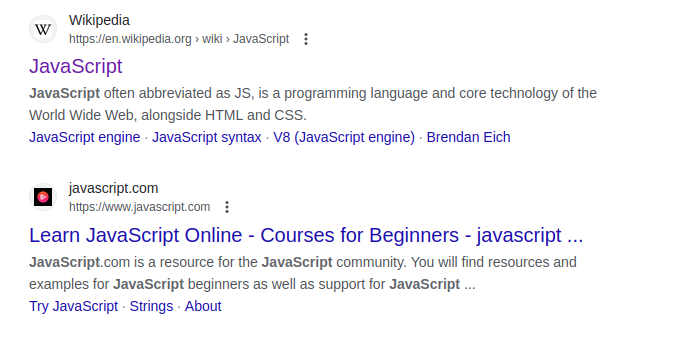
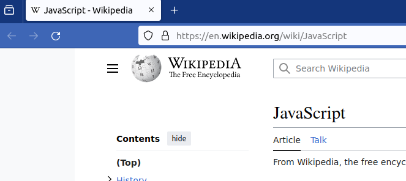

# SEO

Table of contents

- [Introduction: what is technical SEO.](#introduction-what-is-technical-seo)
- [When and why do we need to think about technical SEO.](#when-and-why-do-we-need-to-think-about-technical-seo)
- [Golden rule of SEO.](#golden-rule-of-seo)
- [Mobile-friendly or compatible with all screen sizes.](#mobile-friendly-or-compatible-with-all-screen-sizes)
- [Performance or pagespeed.](#performance-or-pagespeed)
- [Site and page meta data, Open Graph protocol.](#site-and-page-meta-data-open-graph-protocol)
- [Image optimization.](#image-optimization)
- [Robots.txt.](#robotstxt)
- [Sitemap.xml.](#sitemapxml)
- [URLs, HTTPS protocol.](#URLs-HTTPS-protocol)
- [Page links.](#page-links)
- [Error pages.](#error-pages)
- [Redirects.](#redirects)
- [Semantical page structure, semantical markup Schema.org.](#semantical-page-structure-semantical-markup-schemaorg)

# Checklist

# SEO Best Practices Checklist

- [ ] **When and Why Think About Technical SEO**
  - Prioritize technical SEO during web development to enhance user experience, safety, compatibility with various screens, and addressing user needs effectively.

- [ ] **Golden Rule of SEO**
  - Focus on user experience as what's good for users is good for search engines, highlighting the importance of technical SEO.

- [ ] **Mobile-friendly or Compatible with All Screen Sizes**
  - Ensure web applications are usable on all screen sizes to accommodate users on any device, following de facto standards unless explicitly requested otherwise.

- [ ] **Performance or Pagespeed**
  - Optimize website performance based on Core Web Vitals and PageSpeed Insights recommendations for increased user satisfaction and better search engine rankings.

- [ ] **Site and Page Meta Data, Open Graph Protocol**
  - Optimize page metadata (title, description, keywords) and implement Open Graph protocol to enhance search engine visibility and improve user experience during site navigation.

- [ ] **Image Optimization**
  - Optimize images with alt attributes, specified width and height, srcset, loading strategy, and CDN usage for improved page load time and better user experience.

- [ ] **Robots.txt and Sitemap.xml**
  - Utilize Robots.txt and Sitemap.xml to provide instructions for search engines, facilitating effective crawling and indexing of the site.

- [ ] **URLs, HTTPS Protocol**
  - Prioritize user safety with HTTPS protocol and ensure user-friendly URLs for improved search engine rankings and enhanced user experience.

- [ ] **Page Links, Error Pages, Redirects**
  - Utilize internal links, create user-friendly error pages, and implement proper redirects (301) for improved navigation, user engagement, and SEO preservation.

- [ ] **Semantical Page Structure, Schema.org**
  - Use semantic HTML tags and Schema.org markup to enhance accessibility and inform search engines about the page content for potential search enhancements.


## Introduction: what is technical SEO

Technical SEO comprises a set of solutions aimed at optimizing your web application for both end-users and search engines. By implementing technical SEO, you ensure that your website is user-friendly, convenient, secure, fast, and accessible across various screens for users with diverse needs.

## When and why do we need to think about technical SEO

The short answer is "always". During the development of a web application, it's crucial to prioritize the end-user's experience. This involves considerations such as:

- Ensuring the safety of the website, especially when handling personal information.
- Compatibility with various screen sizes and accommodating users with slow internet connections.
- Addressing user needs and questions effectively.

Search engines like Google or Bing assess websites from the user's perspective. Investing in technical SEO is an investment in the overall health of your web application, customer satisfaction, and the success of your business or your client's business. This holds true even if you don't intend to generate site traffic from search engines.

## Golden rule of SEO

The golden rule of SEO is simple: **what is good for the end-user is also good for Google**. There is no magic, no esoteric knowledge, or manipulations — just a focus on user experience. That's why developers should consider technical SEO even if the client doesn't specifically request it. The goal is to create a web application that is excellent for humans, and technical SEO plays a crucial role in achieving this objective.

## Mobile-friendly or compatible with all screen sizes

In January 2024, [almost 60% of all web traffic comes from mobile devices](https://explodingtopics.com/blog/mobile-internet-traffic). This is why Google employs a mobile-first approach when evaluating websites. In essence, the search engine examines your web application from the perspective of a user on a mobile device with a relatively small screen and ranks sites based on this evaluation.

As a result, your web application should be usable on all screen sizes to ensure convenience for end-users on any device. This holds true even if you or your client doesn't plan to acquire traffic from search engines. Furthermore, it remains relevant even if you are aware that almost every user of your site comes from a desktop device.

The de facto standard is to make a site usable on every screen size. You can deviate from this requirement only if the client explicitly requests it for a specific reason, such as prioritizing development velocity. As a developer, it's crucial to ensure that the client is aware of the consequences.

There are various approaches to making a site usable on different screens, such as mobile-first or desktop-first, responsive, or adaptive. Discuss the chosen approach with your client and your team-mates.

## Performance or pagespeed

Google assesses page experience as a key factor in ranking websites. Its algorithms rely on [Core Web Vitals](https://web.dev/articles/vitals#core-web-vitals) as one of the indicators of page experience. Therefore, developers should prioritize optimizing the performance of their websites, as this commitment leads to increased user satisfaction.

For an in-depth understanding of performance requirements, refer to the dedicated chapter available [here](https://github.com/Halo-Lab/non-functional-requirements/blob/main/Performance/Performance.md). Here are key takeaways:

- Utilize the PageSpeed Insights tool to measure page performance, considering it as an indicator rather than an explicit instrument.
- Aim for the green zone for desktop and the amber zone for mobiles according to PageSpeed Insights.
- Use the tool's reports and recommendations to enhance site performance.

For more details on optimizing your application's performance, refer to the performance chapter.

## Site and page meta data, Open Graph protocol

These elements enhance the visibility of your project on search engines. Prior to that, they significantly impact user experience during site navigation.

When contemplating page metadata in the context of SEO, it's crucial to consider the title, description, and keywords. 

### Title

Ensure that you place the title of your pages—or HTML documents—in the `<head>` tag

```html
<head>
    <title>JavaScript</title>
</head>
```

Search engines typically utilize the title to create a snippet of your site on the search results page (SERP).



In addition, browsers display the title in page tabs. 



The title should be informative. For instance, if your pages are dedicated to dragons from the Game of Thrones show, your title could be 'Targaryen's Dragons.' Additionally, the title can incorporate your site name, such as 'Targaryen's Dragons: GoT Fans Database.' It's advisable to limit the title length to 60-70 characters.

### Description

At times, search engines utilize the description to generate a snippet of your page on the SERP. The description should accurately reflect your page's content or address the question, 'What is on that page?'

```html
<head>
    <title>JavaScript</title>
    <meta
      name="description"
      content="JavaScript programming language: in-depth guide" />
</head>
```

It's advisable to limit the description length to 160 characters.

### Keywords

Some time ago, search engines used this metadata to understand the content of the page. However, currently, Google no longer considers this piece of metadata. If your marketing or SEO experts wish to utilize it, you still have the option to do so.

```html
<head>
    <title>JavaScript</title>
    <meta
      name="description"
      content="JavaScript programming language: in-depth guide" />
    <meta
      name="keywords"
      content="JavaScript, programming language, guide" />
</head>
```

### Open Graph protocole

Open Graph (OG) protocol enhances the visibility and attractiveness of your pages on social media platforms such as Facebook, X (formerly Twitter), etc. OG helps social media generate a title, description, and image when somebody shares your page.


Please check [this site](https://ogp.me/) for additional information and a step-by-step guide on implementing the Open Graph (OG) protocol on your pages.

> Tip: If you are using metaframeworks like Next or Gatsby, you can easily implement site metadata and Open Graph (OG) using the tools and recommendations provided by these frameworks.

## Image optimization

Image optimization helps improve page load time, reduce hosting costs, and enhance overall user experience. Here are some tips to help you optimize images.

### Add alt attribute

This attribute is displayed if the browser cannot show an image for some reason. In addition, the `alt` attribute helps users with screen readers understand what is displayed in your image. Note that it is possible to leave the `alt` attribute empty for decorative images such as icons, backgrounds, etc.


```html

```

### Specify width and height attributes in HTML

This prevents layout shift and improves user experience.

```html

```

### Use srcset

This is an image attribute that specifies versions of the image for different screen sizes and resolutions. For example, `srcset` helps the browser choose an image with a width of 360px for mobile screens and an image with a width of 720px for desktop screens. Please check additional information [here](https://developer.mozilla.org/en-US/docs/Web/API/HTMLImageElement/srcset).

> If you are using metaframeworks like Next or Gatsby, check their [guidelines for optimizing images](https://nextjs.org/docs/pages/building-your-application/optimizing/images).

### Choose correct loading strategy

Always use the `loading="lazy"` attribute for below-the-fold images. Consider `loading="eager"` for above-the-fold images that should be rendered immediately to avoid blocking the first contentful paint.

### Use CDN for images

This practice drastically decreases image payloads, and that is beneficial for user experience.

### Robots.txt

This file can contain instructions for search engines. Please [check for additional information and guidelines](https://developers.google.com/search/docs/crawling-indexing/robots/intro).

### Sitemap.xml

This file contains the site structure to help search engines crawl your site. Additional information can be found [here](https://developers.google.com/search/docs/crawling-indexing/sitemaps/overview).

### URLs, HTTPS protocol

Google prioritizes user safety by considering HTTPS as a ranking factor. Therefore, it's important to obtain an SSL certificate and enable HTTPS on your client's site.

URLs on your site should be user-friendly and readable whenever possible. While search engines can work with any URL structure, your clients prefer `https://example.com/tablets/ipad` over `https://example.com/e13rgf-15wer/97yip-yh77`.

### Page Links

Internal links are crucial for both users and web crawlers. Unlike users, bots prefer links with the HTML `<a>` tag. Therefore, it's important to check whether your framework supports this capability. For example, Next.js' `Link` component extends the `<a>` tag with additional capabilities.

### Error pages

The 404 Error Page should be user-friendly and consistent with the design of the entire site. It should also aim to engage users and encourage them to explore other relevant content on the site. One effective approach is to provide alternative suggestions or links to related content, similar to saying, 'Hey, we don't have blue cars, but look here, we have yellow cars, which are almost what you're looking for.'

### Redirects

If a client asks you to delete pages, it's important to discuss redirecting the deleted pages' URLs to existing pages instead of displaying a 404 error. Implementing a permanent redirect (301) is generally better for both users and SEO, as it ensures a smoother experience and preserves the SEO value of the deleted pages.

### Semantical page structure, semantical markup Schema.org

Try to use semantic HTML tags, such as `<main>`, `<article>`, etc., as they are helpful for users, especially for those who use screen readers, and for search bots. Additionally, incorporating semantic markup from [Schema.org](https://schema.org/), if possible, informs Google about your page's content and may enable search enhancements, also known as rich snippets, on the search results page.

## Summary

### When and Why Think About Technical SEO
Technical SEO should be prioritized during web application development to enhance the end-user experience, prioritize safety, accommodate various screen sizes and slow internet connections, and effectively address user needs.

### Golden Rule of SEO
The golden rule of SEO emphasizes that what is good for the end-user is also good for search engines, highlighting the importance of user experience in web development.

### Mobile-Friendly or Compatible with All Screen Sizes
With mobile traffic comprising a significant portion of web traffic, websites should be usable on all screen sizes to ensure convenience for users across devices.

### Performance or Pagespeed
Optimizing website performance, as measured by tools like PageSpeed Insights and Core Web Vitals, is crucial for enhancing user satisfaction and improving search engine rankings.

### Site and Page Meta Data, Open Graph Protocol
Optimizing page metadata, including title, description, and keywords, along with implementing the Open Graph protocol, enhances visibility on search engines and improves user experience during site navigation and social media sharing.

### Image Optimization
Optimizing images with attributes like alt text, specifying width and height, using srcset, and choosing the correct loading strategy improves page load time, reduces hosting costs, and enhances user experience.

### Robots.txt and Sitemap.xml
Robots.txt and Sitemap.xml files provide instructions for search engines and help them crawl and index your site effectively, contributing to better search engine visibility.

### URLs, HTTPS Protocol
Using user-friendly URLs and enabling HTTPS protocol not only prioritizes user safety but also improves search engine rankings.

### Page Links, Error Pages, Redirects
Internal links, user-friendly error pages, and proper redirects enhance user experience and SEO by improving site navigation and preserving SEO value during page deletions.

### Semantical Page Structure, Schema.org
Using semantic HTML tags and incorporating Schema.org markup informs search engines about your page's content and enhances search enhancements, known as rich snippets, on search engine results pages.

